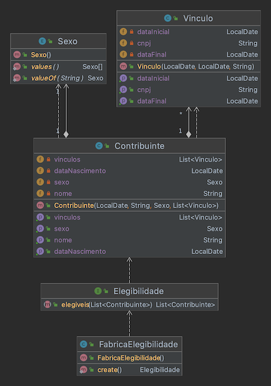

## Atividade

Utilizando as funções de Streams do Java, escreva um programa capaz de encontrar os contribuintes estão aptos a se aposentar. Para isso, considere as seguintes regras:

1. Possuir mais de 65 anos, caso seja do sexo masculino
2. Possuir mais de 62 anos, caso seja do sexo feminino
3. Pelo menos 240 meses de contribuição para sexo masculino (somando todos vínculos)
4. Pelo menos 180 meses de contribuição para sexto feminino (somando todos vínculos)

Para implementação, você deverá implementar a interface Elegibilidade e retornar uma instância para aimplementação na FabricaElegibilidade.

```java
package br.ufrn.imd;

import java.util.List;

/**
 * Interface responsável por padronizar estratégias de verificação de elegibilidade dos contribuintes.
 */
public interface Elegibilidade {

    /**
     * Verifica a elegibilidade para aposentadoria de uma lista de contribuintes.
     * @param contribuintes contribuintes a serem verificados
     * @return Lista contendo apenas contribuintes aptos a se aposentarem
     */
    List<Contribuinte> elegiveis(List<Contribuinte> contribuintes);

}
```

A seguinte estrutura de classes é fornecida:




Pontos de atenção:

1. Utilize a APi de streams do Java 8 para realizar os processamentos

## Testes

O programa possui testes automatizados implementados. Se quiser testar execute o seguinte comando:

```console
$ ./gradlew test
```